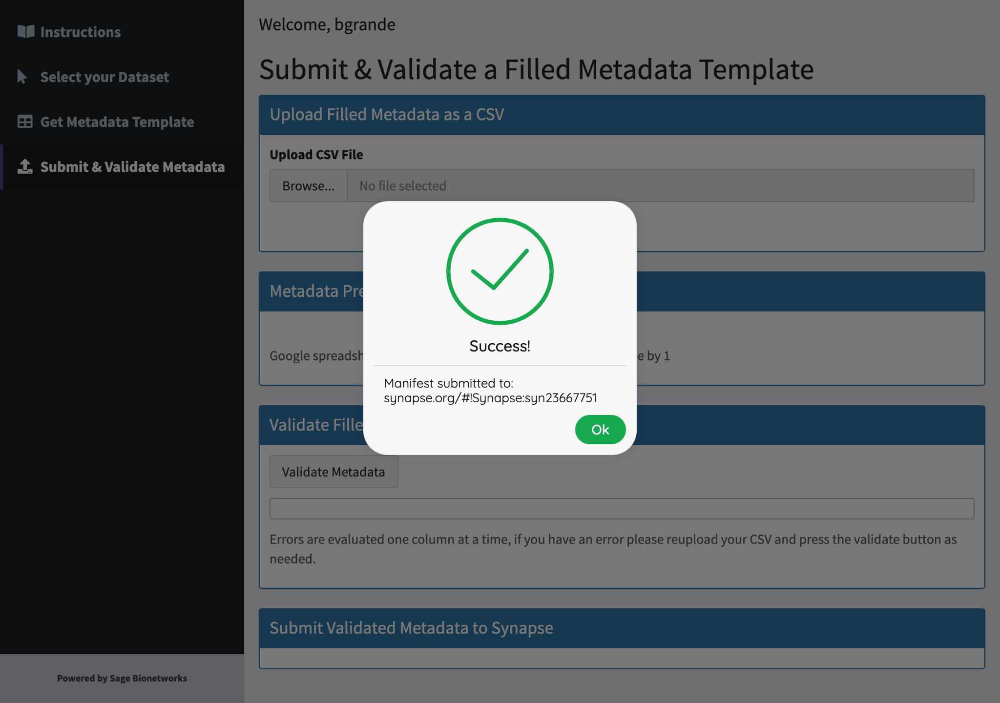

# Update Existing Metadata

Now you'd like to update your metadata in order to:

- Correct mistake(s) 
- Provide further/change metadata to comply with a new iteration of the DCC data model affecting your datasets' metadata
- Provide metadata for files that have been added to your dataset

## Pre-requisites

- You are a [certified user on Synapse](https://docs.synapse.org/articles/accounts_certified_users_and_profile_validation.html#certified-users)
- You have [uploaded your dataset to the DCC](uploading-data)

## Step-by-Step

> In this how-to, we'll be using an example `Assay: Bulk RNA-seq` dataset named `CohortN - DatasetX` located in a Synapse Project called `CenterA`. This is a dataset that's been annotated according to [these instructions](curate-metadata-first-time).



6. Click on the generated link to open the metadata template in Google Sheets.

    [{:.screenshot}](images/screenshots/curator-link-after-2.png)

7. All previously validated metadata are available.

    [{:.screenshot}](images/screenshots/gsheets-prefilled-before.png)

8. Update the metadata accordingly (here, by adding a new row/file for a new sample).
    - **Note**: You can also download the spreadsheet as a CSV file and use a method of your choice to fill it out. The metadata CSV file will be validated by the Data Curator before submission regardless of the method used to update the template.
   
    [{:.screenshot}](images/screenshots/gsheets-prefilled-after.png)

9. If completed in Google Sheets, download the manifest template as a CSV file once it's been updated (File -> Download -> Comma-separated values).

    [{:.screenshot}](images/screenshots/gsheets-prefilled-export.png)

10. Back in the [Data Curator]({{ site.aux_links["Data Curator"][0] }}){:target="_blank"}, navigate to the "**Submit & Validate Metadata**" section in the left-hand menu. 

    [{:.screenshot}](images/screenshots/curator-validate-before.png)

11. Click on the "**Browse**" button to upload your CSV file, and check the preview of your file to make sure everything looks correct. 

    [{:.screenshot}](images/screenshots/curator-validate-prefilled-after.png)

12. Validate your CSV file by clicking the "**Validate Metadata**" button. If the CSV file is validated successfully, you will see a "**Your metadata is valid!**" message, and a "**Submit to Synapse**" button will appear at the bottom of the page. If you encountered validation errors, address them first before re-validating and submitting the metadata ([an example](step-3)).

13. Submit the metadata by clicking on the "**Submit to Synapse**" button. 
   
    [{:.screenshot}](images/screenshots/curator-validate-prefilled-success.png)
   
    <!-- [{:.screenshot}](images/screenshots/curator-validate-submitting.png) -->

15. Success! 
   
    [{:.screenshot}](images/screenshots/curator-validate-prefilled-submitted.png)

16. Check your metadata CSV file on Synapse by using the link that appears in the "**Success!**" pop-up. Alternatively, navigate to the dataset folder in your Synapse project where you will find the updated metadata CSV file.

**Please contact your [DCC liaison](dcc-liaison) if you cannot resolve a metadata error or have questions regarding metadata updates and submission.**

